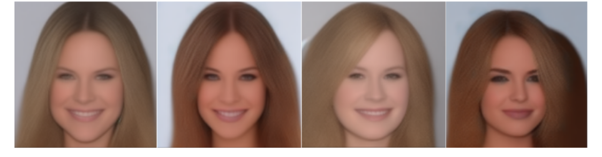
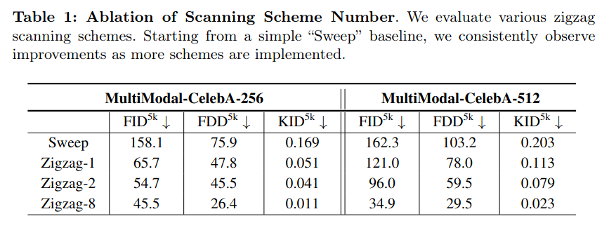
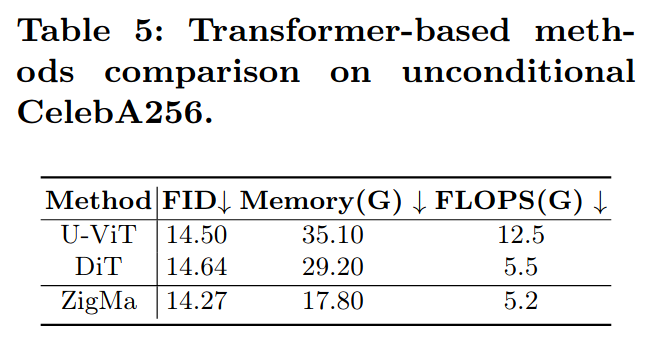
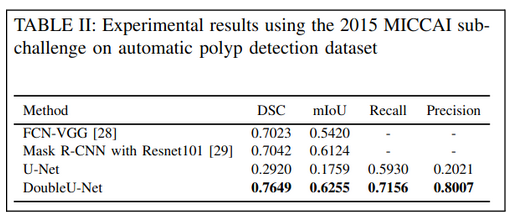
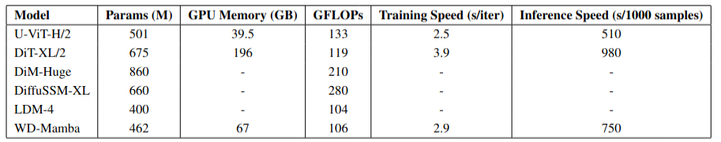
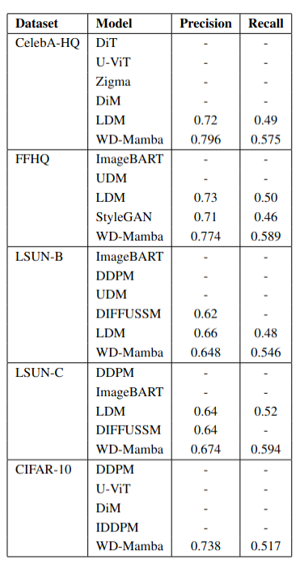
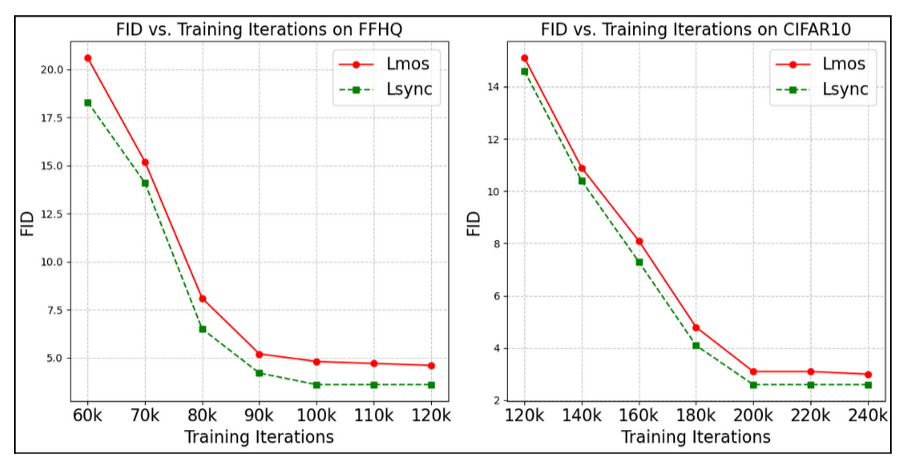

# Rebuttal_WD_Mamba

# Project Files

## Images and Tables

### CelebA Dataset  

### Table 1 (Zigma)  

### Table 5 (Zigma)  

### Table II (DoubleU-Net)  

### Table GFLOPs  

### Table Precision-Recall  

### Updated Figure 4  

